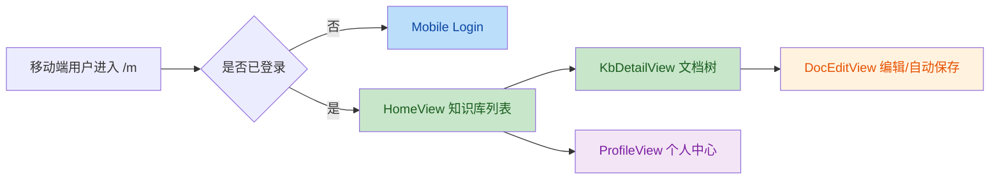

# 移动端代码评审报告

评审范围：`/Users/liyc/code/github-me/hellodoc/hellodoc-client/src/mobile`

评审方式：静态代码评审，结合路由、鉴权、请求层和现有 Web 端实现进行交叉核对；关键问题已做独立二次复核。

## 意图判断

这版代码的目标比较明确：快速搭一套独立的 `/m` 移动端流程，覆盖登录、知识库列表、目录树、文档编辑和个人中心，并尽量复用现有 API 与编辑器能力。

## 变更理解

## 评审结论

| No. | Issue Title | Suggestion | Code Link |
|-----|-------------|------------|-----------|
| 1 | `[高]` 自定义返回逻辑实际上没有生效 | `HeaderNav` 不要用 `useAttrs().onBack` 判断是否触发自定义返回；这里 `back` 已声明在 `defineEmits` 中，监听器不会出现在 `attrs`。建议直接 `emit('back')`，或改成显式 `backHandler` prop。当前会影响目录页返回首页、编辑页返回前保存。 | [HeaderNav.vue:L46-L55](file:///Users/liyc/code/github-me/hellodoc/hellodoc-client/src/mobile/components/HeaderNav.vue#L46-L55) |
| 2 | `[高]` 文档保存失败后仍被标记为“已保存” | `DocEditView` 的 `handleSave` 在 `catch` 里不应清掉 `isDirty`。失败时应该保留脏状态并提示错误，否则自动保存和离页补保存都不会再触发，存在内容丢失风险。 | [DocEditView.vue:L402-L423](file:///Users/liyc/code/github-me/hellodoc/hellodoc-client/src/mobile/views/DocEditView.vue#L402-L423) |
| 3 | `[高]` 移动端登录没有保存 `refreshToken`，会话续期链路断掉 | 登录成功后建议与现有 Web 登录保持一致，至少保存 `accessToken`、`refreshToken`、`username/nickname/avatar`。现在 token 过期后，共享请求层无法静默刷新。 | [LoginView.vue:L73-L79](file:///Users/liyc/code/github-me/hellodoc/hellodoc-client/src/mobile/views/LoginView.vue#L73-L79) |
| 4 | `[高]` 401 失效后会被硬跳到桌面登录页 | `request.ts` 里 401 刷新失败后固定跳 `/login`，移动端应根据当前路径跳 `/m/login`，或者统一走路由层处理，否则移动端会跳错端。 | [request.ts:L103-L135](file:///Users/liyc/code/github-me/hellodoc/hellodoc-client/src/utils/request.ts#L103-L135) |
| 5 | `[高]` 退出登录没有清理完整本地状态 | `ProfileView` 退出时遗漏了 `refreshToken` 和 `email`，前者会留下旧会话续期隐患，后者可能让下一个用户先看到上一个用户的本地信息。 | [ProfileView.vue:L83-L129](file:///Users/liyc/code/github-me/hellodoc/hellodoc-client/src/mobile/views/ProfileView.vue#L83-L129) |
| 6 | `[中]` 首页知识库数量统计是典型 N+1 请求 | `getKbList()` 后又对每个知识库调用一次 `getAuthDocuments` 统计数量，知识库一多首页会明显变慢。更合适的是后端直接返回计数，或至少改成懒加载/进入详情页后再取。 | [HomeView.vue:L207-L220](file:///Users/liyc/code/github-me/hellodoc/hellodoc-client/src/mobile/views/HomeView.vue#L207-L220) |

## 补充说明

1. 本次结论以静态评审为主，没有起真机或浏览器做完整交互回归。
2. 但高优先级问题都不是样式层建议，而是会直接影响可用性、数据安全或登录体验的真实风险。
3. 建议修复顺序：`1 -> 2 -> 3 -> 4 -> 5 -> 6`。
